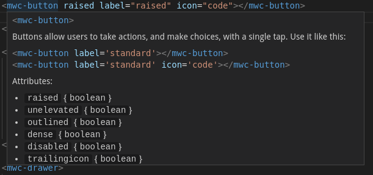

# Material Web Components VS Code Extension

This VS Code extension offers auto completion and hover information for all [Material Web Components](https://github.com/material-components/material-components-web-components) inside html and css files. The Material Web Components (MWC) are a collection of [Web Components](https://developer.mozilla.org/en-US/docs/Web/Web_Components) maintained by Google that implement [Material Design](https://material.io/design/).

This project is still in beta phase. Material Web Components is still a work in progress and doesn't have a major release yet. Besides it uses [VS Code Custom Data](https://github.com/microsoft/vscode-custom-data) format, that it's fairly new thing (but at least it has a major version) and may not be supported by the language server of some web frameworks (e.g. Vue, Svelte, etc...).

[API demos](https://material-components.github.io/material-components-web-components/demos/index.html)

[Sandbox demo on Glitch](https://mwc-demos.glitch.me/)

## Demo

### HTML

### CSS

## Install

You can install the extension searching for the `Material Web Components` in VS code extension panel or in the [Marketplace](https://marketplace.visualstudio.com/items?itemName=arleyristar.mwc-vscode)

## Next Releases

To update this extension to the next release of the MWC, one must:

- Bump up the MWC dependencies and analyze versions to the desired one inside `packages.json`.
- Run `yarn analyze` to generate a new `src/analyzed/html-data.x.y.z.json` file that contains the web components information in the custom VS Code custom format.
- Compare the previous version of the analyzed file with the current one (I prefer this method instead of looking at the documentation, it lags behind the code).
- After comparing the differences, update `src/mwc.html-data.json` accordingly.
- Now, to update the descriptions and the css information, compare the README of the MWC current version of this extension with the desired one. Change the versions on this link: https://github.com/material-components/material-components-web-components/compare/v0.14.0...v0.15.0?diff=unified#files_bucket to compare.
- Compare the README of each MWC package, updating `src/mwc.html-data.json` and `src/mwc.css-data.json` accordingly.

## License

MIT © [Arley Ristar](https://github.com/arleyristar)
